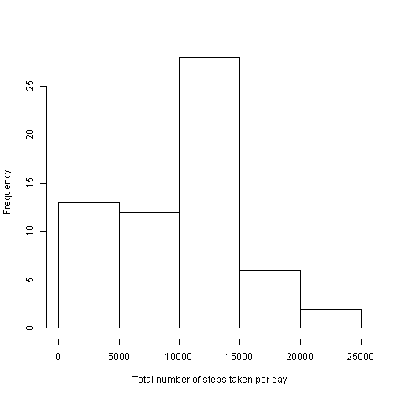
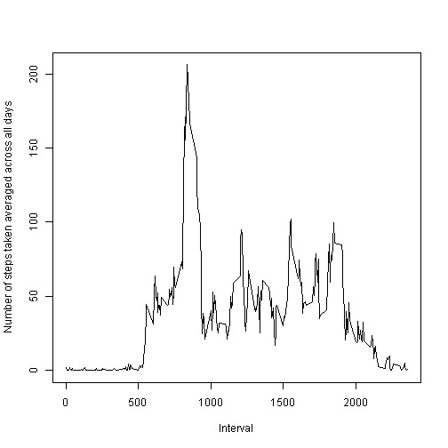
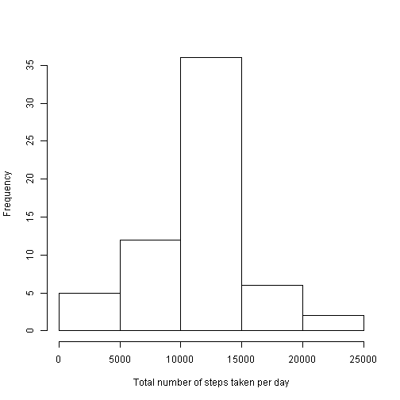
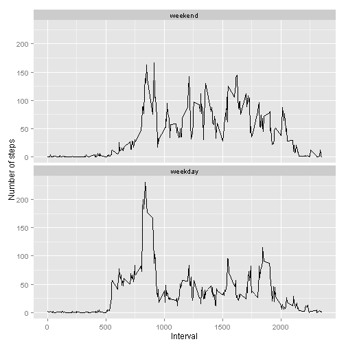

# Analysis of Personal Activity Monitor Data

This analysis makes use of data from a personal activity monitoring device. This device collects data at 5 minute intervals through out the day. The data consists of two months of data from an anonymous individual collected during the months of October and November, 2012 and include the number of steps taken in 5 minute intervals each day.

## Loading and preprocessing the data
- The source data is unzipped assuming this has been previously downloaded. 
- The raw data is read from the csv file. 
- The date column of data frame is converted from character representation to that of class Date.

```r
unzip("activity.zip")
data <- read.csv("activity.csv")
data$date <- as.Date(data$date, "%Y-%m-%d")
```

- The analysis makes use of "plyr" and "dplyr" r packages which are loaded into the session.

```r
library(plyr)
library(dplyr)
```

## What is mean total number of steps taken per day?
- The processed data is summarized to calculate  total number of steps taken per day using ddply function and ignoring the missing values.

```r
data_sum1 <- plyr::ddply(data, .(date), dplyr::summarise, steps=sum(steps, na.rm = T))
```

- A histogram of total number of steps taken per day is presented below.

```r
hist(data_sum1$steps, xlab = "Total number of steps taken per day", main = "")
```

 

- The mean of the total number of steps taken per day is 9354.23.
- The median of the total number of steps taken per day is 10395.

## What is the average daily activity pattern?
- The processed data is summarized to calculate average number of steps taken for every interval averaged across all days using ddply function and ignoring the missing values.

```r
data_sum2 <- plyr::ddply(data, .(interval), dplyr::summarise, steps=mean(steps, na.rm = T))
```

- A time series plot of interval and average number of steps taken for every interval averaged across all days is presented below.

```r
plot(data_sum2$interval, data_sum2$steps, type="l", xlab = "Interval", 
     ylab = "Number of steps taken averaged across all days")
```

 

- The interval which has maximum number of steps averaged across all the days is 835.

## Imputing missing values
- Total number of mising values in steps as present in the raw data is 2304.
- The missing values in the raw data is replaced with the mean of respective interval across all days.

```r
data2 <- data
impute.mean <- function(x) replace(x, is.na(x), data_sum2$steps)
data2$steps <- impute.mean(data2$steps)
```

- The processed data is summarized to calculate  total number of steps taken per day using ddply function.

```r
data_sum3 <- plyr::ddply(data2, .(date), dplyr::summarise, steps=sum(steps))
```

- A histogram of total number of steps taken per day after handling missing values is presented below.

```r
hist(data_sum3$steps, xlab = "Total number of steps taken per day", main = "")
```

 

- The mean of the total number of steps taken per day is 10766.19.
- The median of the total number of steps taken per day is 10766.19.

## Are there differences in activity patterns between weekdays and weekends?
- A new factor variable with two levels ‚<U+0080><U+0093> ‚<U+0080><U+009C>weekday‚<U+0080>ù and ‚<U+0080><U+009C>weekend‚<U+0080>ù is introduced in the dataset with missing values imputed. This indicates whether a given date is a weekday or weekend day.

```r
week_days <- c('Monday', 'Tuesday', 'Wednesday', 'Thursday', 'Friday')
data2$daytype <- factor((weekdays(data2$date) %in% week_days), 
                        levels=c(FALSE, TRUE), labels=c('weekend', 'weekday'))
```

- The processed data is summarized to calculate average number of steps taken for every interval averaged across all week days and weekend days using ddply function.

```r
data_sum4 <- plyr::ddply(data2, .(interval, daytype), dplyr::summarise, steps=mean(steps))
```

- A panel plot containing a time series plot of interval and the average number of steps taken, averaged across all weekday days or weekend days is presented below.

```r
library(ggplot2)
ggplot(data_sum4, aes(interval, steps)) + geom_line() + facet_wrap(~daytype,nrow = 2) + 
  xlab("Interval") + ylab("Number of steps")
```

 
